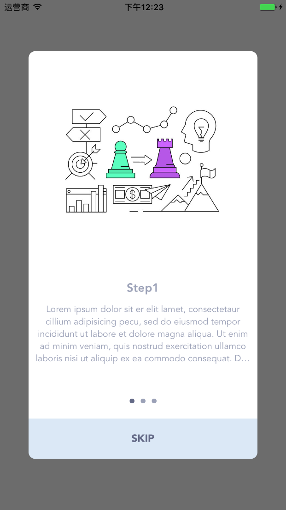

## Requirements

* iOS 8.0+
* Xcode 8 with Swift 3

## Installation

#### CocoaPods

```ruby
pod 'Board'
```

## Preview



## Usage

```swift
let s1 = Board.Page("Step1", "Lorem ipsum", "img1")
let s2 = Board.Page("Step2", "Lorem ipsum", "img2")
let s3 = Board.Page("Step3", "Lorem ipsum", "img3")

let alertView = Board(pages: [s1, s2, s3])
alertView.delegate = self // BoardDelegate
alertView.show()
```

```swift
class SomeClass: BoardDelegate {
    func board(_ b: Board, didTriggerAction action: Board.Action, step: Int, total: Int) {
        switch action {
        case .skipped:
            print("Board: skipped the \(step) step")
        case .completed:
            print("Board: completed!")
        default:
            print("Board: Go to next step! \(step)")
        }
    }
}
```
